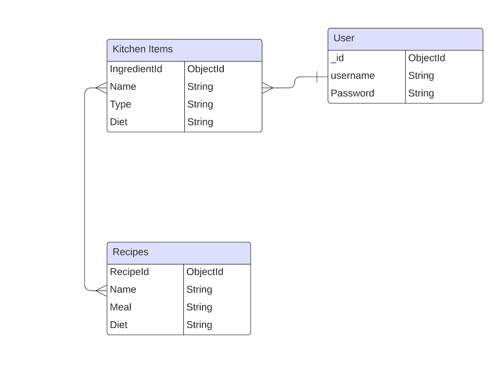
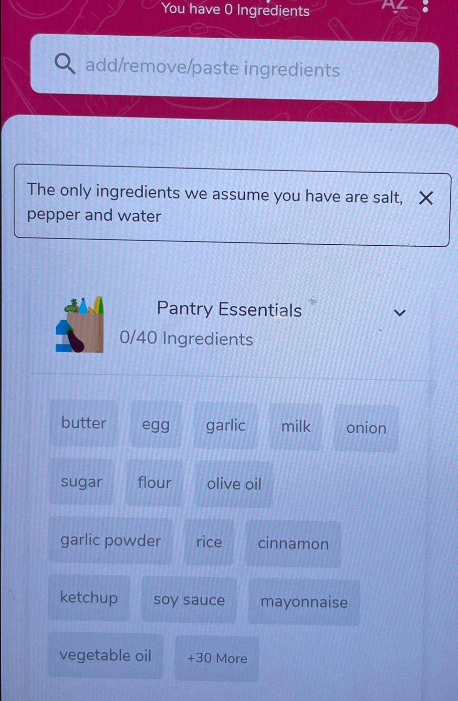
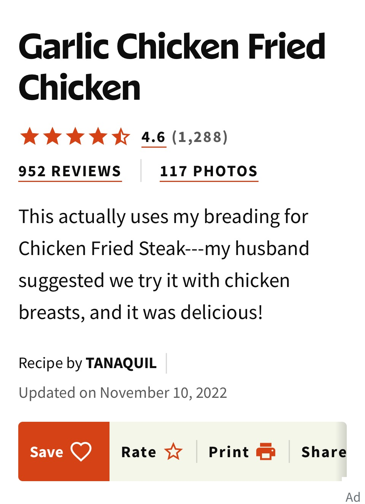
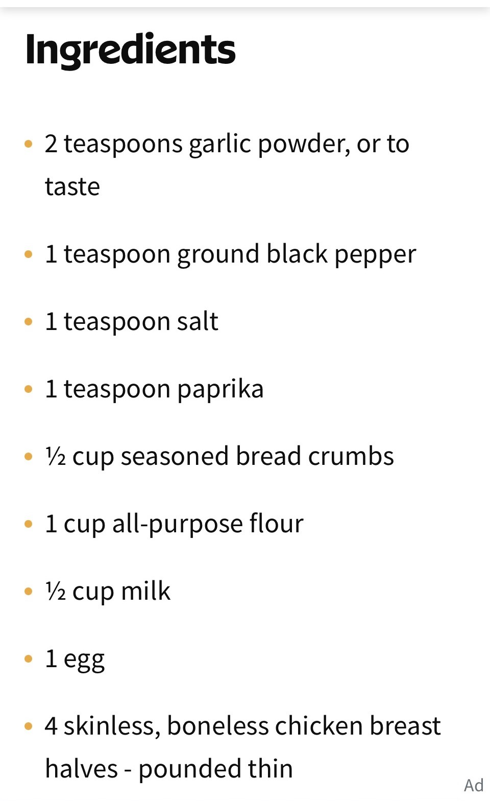

# Title: Lets Cook

Ever open the fridge and not know what to cook? Let this app help you cook up an idea. Add ingredients you have on hand like chicken, rice, eggs, ect. and the app will sort recipes based on those ingredients.

## Built With: 
- Node
- Express
- HTML
- CSS
- JavaScript
- API
- Bootstrap
- OAuth
- Moongoose

Link To Game: https://github.com/Tessabaxter12/Lets-Cook.git

### ERD

## Users Story
- Make Profile
- Login
- Add Ingredients
- Search Recipes
- View Recipes
- Add And Delete A Favortie Recipes to profile
- Sign Out

## Wireframe

- Allows The User To Insert Ingredients On Hand From Kitchen.

- Then Shows Multiple Recipes User Can Choose From.

- Then A User Can Select Individual Recipes To View.

- Then Can View Individual Recipes Ingredients.

## Icebox Features
- User Can Leave Reviews
- Search Based On Type Of Meal
- Search Based On Food Allergies Or Diet