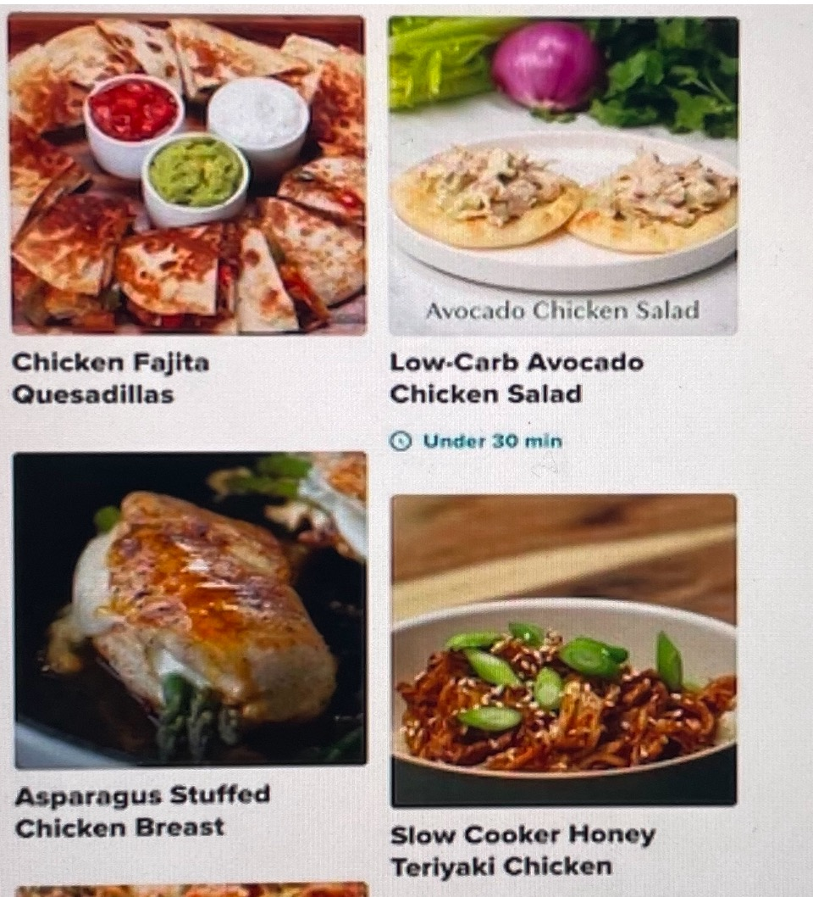

# Title: Lets Cook

Ever open the fridge and not know what to cook? Let this app help you cook up an idea. Search by random recipes or add a main ingredient you have on hand like chicken, fish, eggs, ect. and the app will sort recipes based on that ingredient.

## Built With: 
- Node
- Express
- HTML
- CSS
- JavaScript
- API
- Bootstrap
- OAuth
- Moongoose

Link To Game: https://github.com/Tessabaxter12/Lets-Cook.git

### ERD

## Users Story
- Make Profile
- Login
- Search Recipes
- Search Recipe By Ingredients
- Add And Delete A Favortie Recipes to profile
- Sign Out

## Wireframe

- Allows The User To Insert An Ingredient On Hand From Kitchen.

- Then Shows Multiple Recipes User Can Choose From.

- Then A User Can Select Individual Recipes To View.

- Then Can View Individual Recipes Ingredients.

## Icebox Features
- Search Based On Type Of Meal
- Search Based On Food Allergies Or Diet